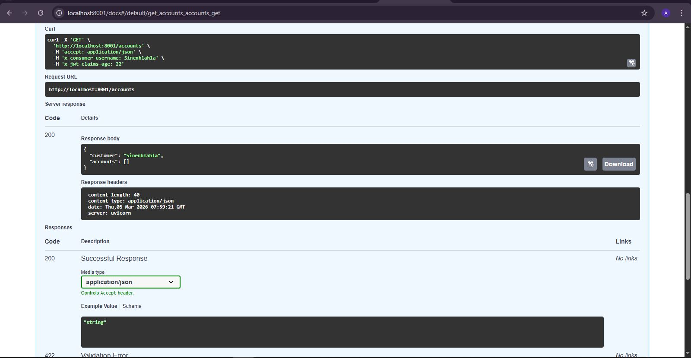
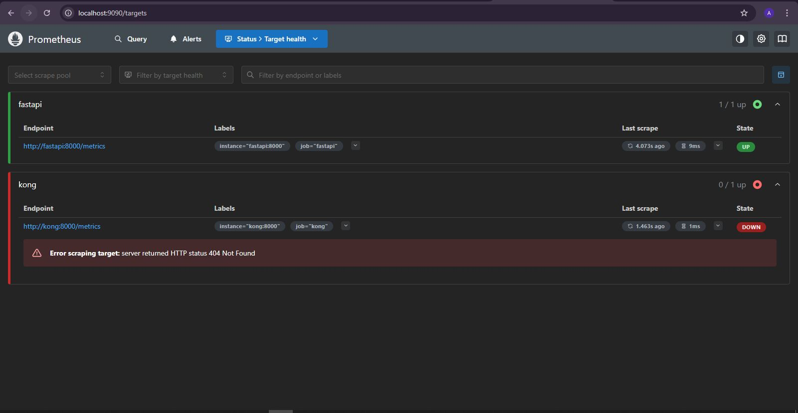
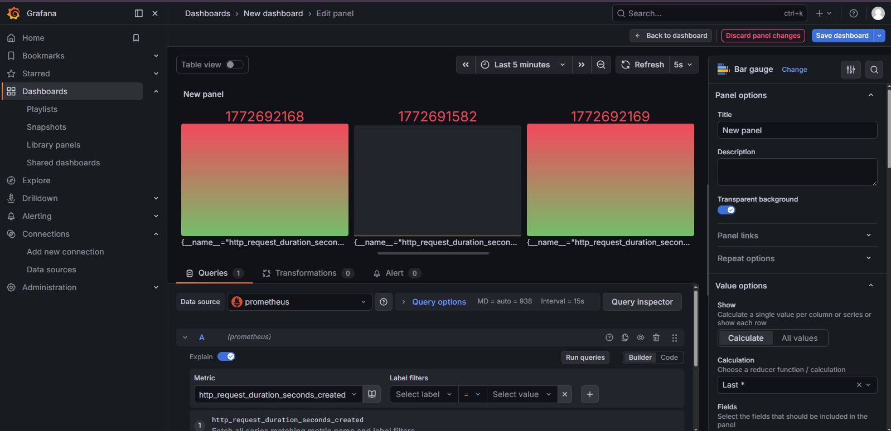
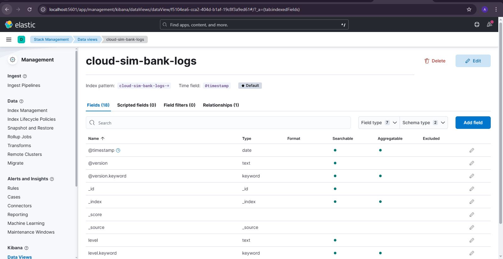

# Cloud-Sim Bank: Cloud Simulation with Microservices, Monitoring, and ELK Stack

## Architecture


This project simulates a cloud-native banking system using microservices and open-source tools. It demonstrates how distributed services, API gateways, and monitoring stacks interact in a realistic banking environment.

**Architecture Overview:**

- Client requests go through **Kong API Gateway**  
- Microservices handle business logic:
  - **Account Service** – Manages user accounts  
  - **Transaction Service** – Handles banking transactions  
  - **FastAPI** – Optional integration service exposed via Kong  
- **PostgreSQL** provides data persistence  
- **Prometheus + Grafana** monitor system metrics  
- **ELK Stack** (Elasticsearch, Logstash, Kibana) collects logs centrally  


This conceptual diagram illustrates request flow, monitoring, and logging interactions within the system.

---

## Database Design


The ER diagram shows the relationships between key entities such as accounts and transactions. This ensures proper database design and referential integrity.

---

## Microservices and API Gateway

**Services Included:**

| Service | Language / Framework | Purpose | Port |
|---------|-------------------|---------|------|
| Account Service | Java Spring Boot | Manages user accounts | 8081 |
| Transaction Service | Java Spring Boot | Handles banking transactions | 8082 |
| FastAPI | Python | Optional backend integration | 8001 |
| Kong API Gateway | Kong | Routes requests and enforces security | 8000 |
| PostgreSQL | PostgreSQL | Database storage | 5432 |

**FastAPI Interactive Docs:**



Explore and test endpoints at `http://localhost:8001/docs`.

---

## Monitoring Stack

Prometheus and Grafana provide full observability:

- **Prometheus** collects metrics from all services via `/metrics` endpoints  
- **Grafana** visualizes metrics on dashboards  

**Prometheus Targets:**



Check that all services show `UP` to confirm metrics are being scraped successfully.

**Grafana Dashboard:**



Default login credentials:

- Username: `admin`  
- Password: `admin` (you will be prompted to change it on first login)

Dashboards display metrics for request throughput, latency, microservice health, and database performance.

---

## Logging with ELK Stack

The ELK stack provides centralized logging:

| Tool | Purpose |
|------|---------|
| Elasticsearch | Stores logs |
| Logstash | Processes logs |
| Kibana | Visualizes logs |

**Kibana Logs Dashboard:**



To view logs:

1. Open `http://localhost:5601`  
2. Navigate to **Stack Management → Index Patterns**  
3. Create an index pattern: `logstash-*`  
4. Go to **Analytics → Discover** to view service logs  

**Elasticsearch Root JSON Response**:

Open `http://localhost:9200` to confirm Elasticsearch cluster is running. You will see JSON output with cluster name, node name, and version.

---

## How to Run the System with Docker

Ensure **Docker and Docker Compose** are installed.

```bash
# Clone the repository
git clone https://github.com/inkosii/youth_cloud_banking_system.git
cd youth_cloud_banking_system

# Build and start all services
docker compose up --build
